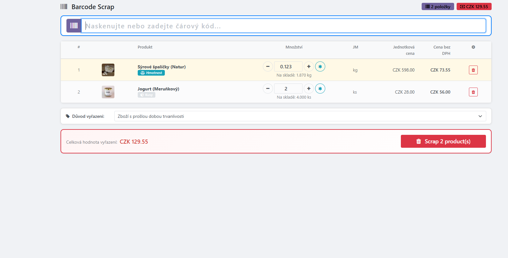
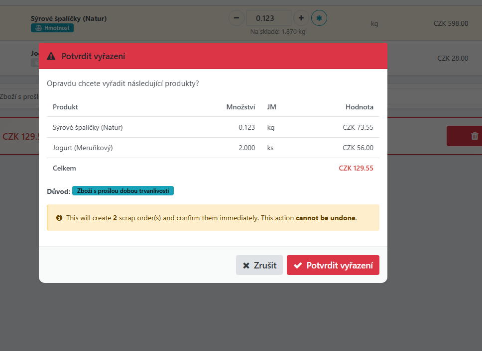
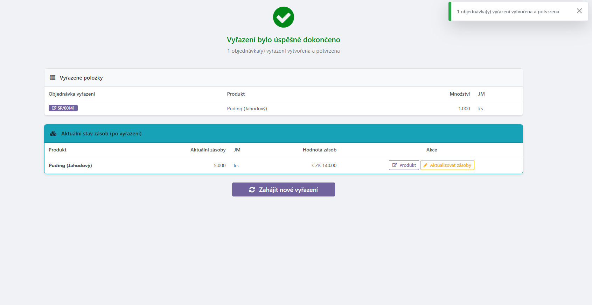

# MRP Barcode Scrap

Odoo 18 Community Edition addon for batch scrapping products via barcode scanning.

## Features

- **POS-like barcode scanning interface** — fast, keyboard-driven workflow
- **Weight-embedded barcode support** — automatic detection via Odoo barcode nomenclature
- **Piece-count barcode support** — standard product barcodes increment by 1
- **Running totals** — see quantity and value per scanned product in real-time
- **Editable quantities** — adjust amounts with +/- buttons or direct input
- **Configurable default scrap reason** — set once, use every time
- **Total scrap value** — always visible summary
- **Batch scrap creation** — one click creates separate scrap orders per product and confirms them
- **Confirmation popup** — review everything before committing
- **Post-scrap stock review** — see updated stock values with links to adjust inventory
- **Czech translation included**

## Screenshots

## Installation

1. Copy the `mrp_barcode_scrap` folder to your Odoo addons directory.
2. Update the apps list in Odoo (Settings → Apps → Update Apps List).
3. Search for "MRP Barcode Scrap" and install.

## Configuration

1. Go to **Manufacturing → Configuration → Scrap Configuration**.
2. Set the default scrap reason (e.g., "Expired product").

## Usage

1. Navigate to **Manufacturing → Barcode Scrap**.
2. Scan product barcodes (or type them manually).
3. Adjust quantities as needed.
4. Edit the scrap reason if necessary.
5. Click **Scrap** and confirm in the popup.
6. Review the post-scrap stock levels and adjust if needed.

## Dependencies

- `mrp` (Manufacturing)
- `stock` (Inventory)
- `barcodes` (Barcode Nomenclature)
- `product` (Products)

## License

LGPL-3
